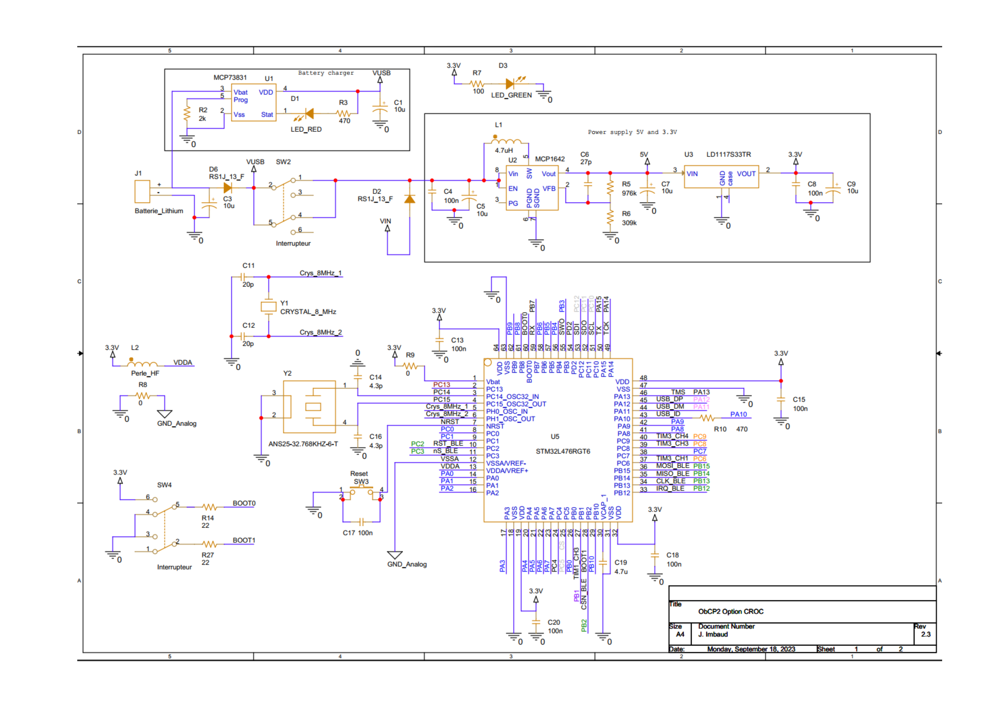

---

# ObCP - Objet Connecté Personnel

  
  
<em>Vue 3D de l'ObCP</em>

Le projet **ObCP** (Objet Connecté Personnel) est une plateforme de développement basée sur le microcontrôleur **STM32L476RG** et les modules **Bluetooth SPBTLE-RF** (avant 2024) ou **BlueNRG-M0** (à partir de 2024). Elle est conçue pour permettre le prototypage d'applications connectées personnalisées.

---

## Fonctionnalités principales

### Composants principaux
- **STM32L476RG** : Capacité de traitement puissante, faible consommation, idéale pour les applications IoT.
- **SPBTLE-RF / BlueNRG-M0** : Communication Bluetooth Low Energy avec une consommation minimale.
  
### Caractéristiques matérielles
- **Sortie PWM** : Contrôle de charges jusqu’à 2,5W sous 5V (fréquence de 20 kHz).
- **Bouton poussoir utilisateur** : Interface utilisateur simple.
- **Batterie Lithium** : Alimentation autonome portable.
- **LED multicolore** : Indication des états ou modes de fonctionnement.
- **Capteur LIS3D** : Mesure les accélérations sur trois axes.

---

## Installation et utilisation sans debugger ST-Link

### Avec STM32CubeProgrammer

1. Téléchargez et installez [STM32CubeProgrammer](https://www.st.com/en/development-tools/stm32cubeprog.html).
2. Connectez votre ObCP en mode "Prog" (SW4) puis appuyez sur "Reset" (SW3).

   
  
<em>Mode "Prog" et bouton "Reset"</em>

3. Le port USB doit à présent être detecté comme actif pour la programmation. Effacer le STM32 (Full chip erase) puis ouvrez l'emplacement du fichier binaire (.elf/.bin/.hex) à l'aide du bouton Browse et enfin cliquez sur Start programming pour charger le programme dans le STM32 via l'interface USB dans CubeProgrammer.

  
  
<em>Configuration de CubeProgrammer</em>

4. Passez SW4 en mode "Run" et appuyez sur SW3 "Reset" pour démarrer le programme.

   
  
<em>Mode "Run" et bouton "Reset"</em>

---

### Avec STM32CubeIDE

#### Configuration avec STM32CubeIDE et CubeProgrammer

  
  
<em>Configuration de STM32CubeIDE pour téléversement en DFU</em>

1. Téléchargez et installez [STM32CubeIDE](https://www.st.com/en/development-tools/stm32cubeide.html) et [STM32CubeProgrammer](https://www.st.com/en/development-tools/stm32cubeprog.html).
2. Configurez STM32CubeIDE pour téléverser directement en mode DFU via la CLI de CubeProgrammer :
   - **Location** : `C:\Program Files\STMicroelectronics\STM32Cube\STM32CubeProgrammer\bin\STM32_Programmer_CLI.exe`
   - **Working directory** : `${workspace_loc}${project_path}\Debug`
   - **Arguments** : `-c port=usb1 -d ${project_name}.elf -s`
3. Placez SW4 en mode "Prog", appuyez sur SW3 "Reset", puis démarrez le téléversement.

   
  
<em>Mode "Prog" et bouton "Reset"</em>

5. Une fois le téléversement terminé, repassez en mode "Run" et redémarrez avec SW3.

   
  
<em>Mode "Run" et bouton "Reset"</em>

---

## Documentation supplémentaire

- **STM32L476RG** : [Documentation officielle](https://www.st.com/en/microcontrollers-microprocessors/stm32l476rg.html).
- **BlueNRG-M0** : [Fiche technique](https://www.st.com/en/wireless-connectivity/bluenrg-m0.html).

---

## Schéma et implantation des composants

  
  
<em>Implantation des composants de l'ObCP</em>

  
  
<em>Schéma électrique - Page 1</em>

  
  
<em>Schéma électrique - Page 2</em>

  
  
<em>Nomenclature complète de l'ObCP</em>

---

**Note :** Ce projet est destiné à des fins de développement et d'apprentissage. Utilisez-le à vos propres risques.

--- 
